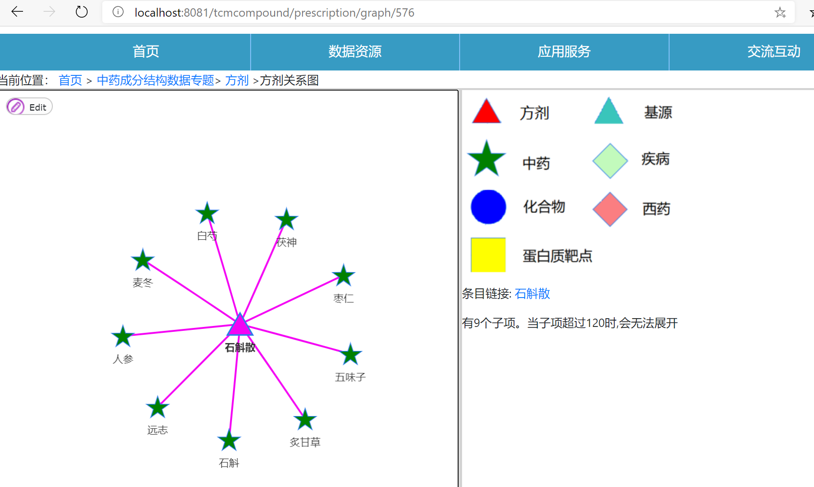
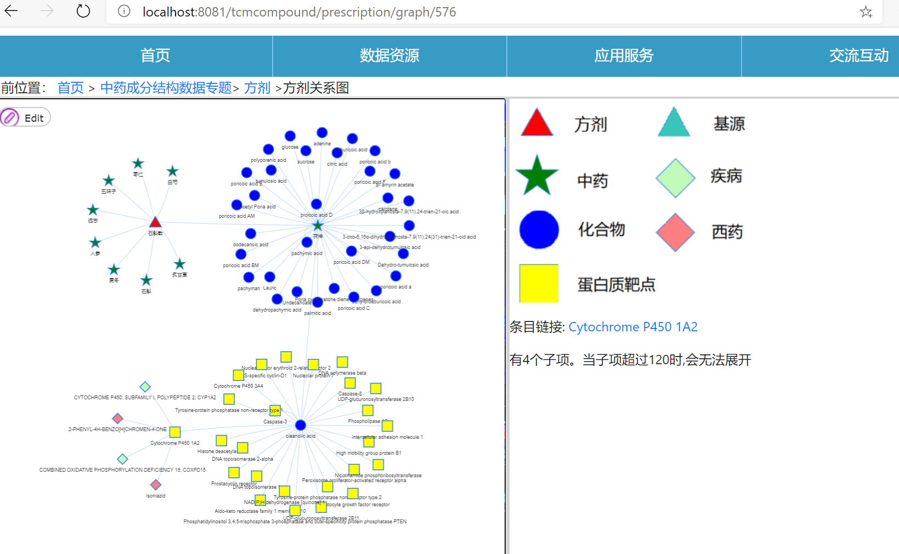
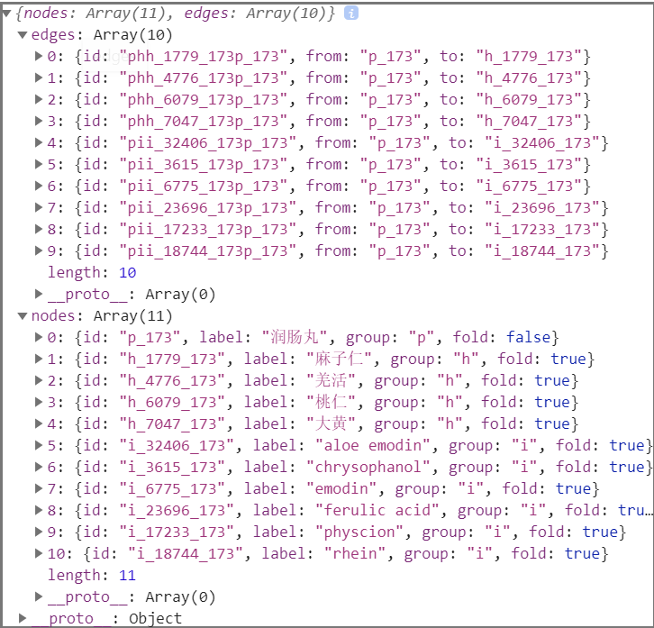

### 数据表说明

**cas_pubchem** 表：在数据库中2个化合物的数据表，分别为compound与ingredient，而这2个表就是通过 cas_pubchem 表进行匹配。cas_pubchem 表是通过在Pubchem官网查询CAS号，然后获取响应的Pubchem ID，产生的。

| cas_pubchem |                                                              |
| ----------- | ------------------------------------------------------------ |
| Compound_ID | compound的ID                                                 |
| CAS         | compound的CAS号                                              |
| Pubchem_ID  | ingredient的字段，可以用来查找对应的ingredient，另一方面也能通过这个ID访问Pubchem官网查看更多资料 |

这样当我们拿到一个ingredient时，可以先取出Pubchem ID，然后就能找到对应的compound，完成了匹配。网页操作：访问ingredient/ *时，如果有对应的compound，会直接重定向至compound/ *,同时将资料也合并过去。


**herb_ingredient** 表：匹配herb与ingredient

| herb_ingredient |                                                    |
| --------------- | -------------------------------------------------- |
| ID              | herb的ID                                           |
| Ingredient_ID   | 对应的ingredient的ID的集合，每个ID间有一个空格分隔 |


**herb_med** 表：在数据库中2个中药的数据表，分别为herb与medicine，而这2个表就是通过 herb_med表进行匹配。这个表是由中药的拼音匹配产生的。

| herb_med  |                    |
| --------- | ------------------ |
| Herb_ID： | herb的ID           |
| Med_ID    | 对应的medicine的ID |

网页操作：访问herb/ *或medicine/ *时，如果有对应的，这会有跳转链接，只是做得随意了些，没有化合物那样合并 。


**prescription_herb** 表：匹配prescription与herb

| prescription_herb |                                              |
| ----------------- | -------------------------------------------- |
| ID                | prescription的ID                             |
| Herb_ID           | 对应的herb的ID的集合，每个ID间有一个空格分隔 |


**prescription_ingredient** 表：匹配prescription与herb

| prescription_ingredient |                                                              |
| ----------------------- | ------------------------------------------------------------ |
| ID                      | prescription的ID                                             |
| Ingredients             | 对应的Ingredient的ID的集合，每个ID间有一个空格分隔（不过数据比较少，大部分都是Null） |


### 可视化：

origin、prescription、herb都有可视化选项。是通过 **Vis.js--Network** 实现的。

#### 官方demo 与文档

https://visjs.github.io/vis-network/examples/

https://visjs.github.io/vis-network/docs/network/

#### 效果

以http://localhost:8081/tcmcompound/prescription/graph/576为例：


初始状态。我们点击节点即可展开，再次点击则会收回。



左侧是关系图，右边是图示，以及所点击的点的链接与子项数。子项数太多可视化会出现混乱，所以超过120这里就直接不显示了。


经过一定的点击，展开后：




注意：中药的展开可能会比较不一样，在prescriptionGraph中的中药，还会展开对应的基源（先找到herb对应medicine,再找基源）。


#### node、edge 数据格式

接着是这次开发的具体数据格式，打开graph页面的时候浏览器控制台会输出。

id名搞得比较麻烦，主要担心会重复。

**edge**：一个id，一个起始点id和一个终点id。

id是边的类型(如ph,hi,pi)+子节点id+父节点id

**node**：一个id，label是说明，group是点的种类（同种类的点显示相同），fold表示节点是否已经展开。

id名是   group+节点数字ID+父节点的数字ID，如果是初始节点，就只是group+数字ID。



#### 可视化网页实现

然后可视化网页的实现，是由*Graph.html(如originGraph.html)实现的。这里我们分为几步：

1.获取容器

首先要在网页中设置一个空的div用于容纳可视化网络。在js中获取它作为容器；

```javascript
var container = document.getElementById('mynetwork');
```


2.获取数据

开始有一个ajax请求，然后到对应类的/graph_init请求接口下，请求初始化的节点与边的json数据，然后保存在data变量中；


```javascript
edges=new vis.DataSet(data.edges);
nodes=new vis.DataSet(data.nodes);
var data = {
    nodes: nodes,
    edges: edges
};
```


3.设置显示选项

主要由options这个变量控制，在options中可调整边、点的样式，还可以针对不同group的点做出不同的显示；

```javascript
var options = {
...
}
```


4.调用显示

```javascript
network = new vis.Network(container, data, options);
```


5.点击响应

通过编写function对单击进行相应的响应操作。当然除了单击也能用其它鼠标动作，只不过我们这里只用到了单击。

```javascript
network.on("click", function (params){})
```


同时，每个Graph网页都有2个通用js函数，为removeNodes()和addNodes()，它们都需要点的ID、还有将进行的请求接口，作为参数。到相应的接口获取到节点与边的数据之后，检查一下数量，若没超过120，则对网络进行增删。注意：因为removeNodes()还需要检查每个子节点是否展开，然后再进行递归删除，所以加入了一个edge_group表示当前在删除哪一层。 

```javascript
function removeNodes(idName,url_s,edge_group) {
}
```

