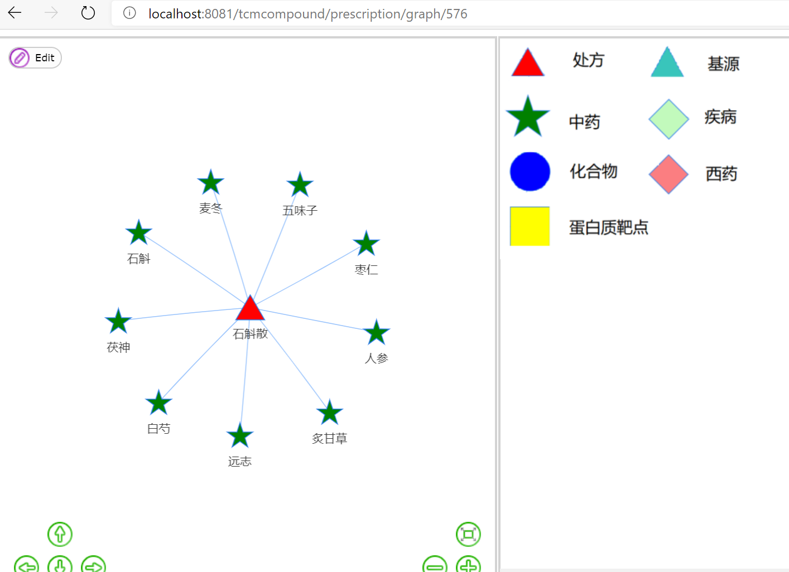
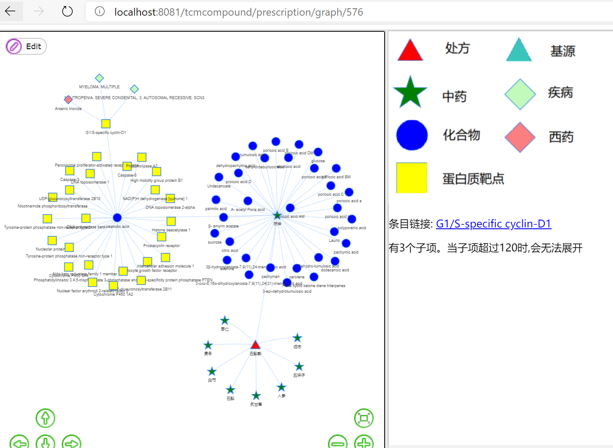
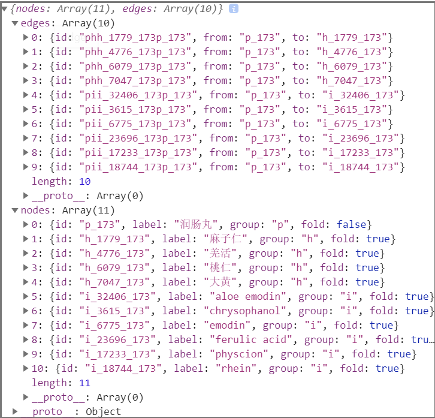

### 数据

cas_pubchem匹配了compound_id与pubchem_id,通过pubchem_id可以找到ingredient，访问ingredient/ *时，如果有对应的compound，会直接重定向至compound/ *,资料同时也合并过去了。

herb_med这个表是由名字匹配产生的，匹配了herb与medicine。访问herb/ *或medicine/ *时，如果有对应的，这会有跳转链接，只是做得随意了些，没有化合物那样合并 。

prescription_herb2其实就是把prescription_herb变成了一条条的，本来搞这个表，是想做一个通过herb找到prescription,但是发现一个herb常常对应上百近千条prescription,所以就还没做。

### lombok

### Mybatis

用Mybatis替换了部分jpa来进行数据库操作。

### 可视化：

origin、prescription、herb都有可视化选项。

#### 效果

以http://localhost:8081/tcmcompound/prescription/graph/576为例

初始，点击节点可展开，再次点击会收回。

经过一定的点击展开后：

注意herb的展开可能会比较不一样，在prescription中herb还会展开对应的基源（先找到herb对应medicine,再找基源）

#### 官方demo  

https://visjs.github.io/vis-network/examples/

#### node、edge 数据格式

接着是这次开发的具体格式，打开graph页面的时候浏览器控制台会输出。

id名搞得比较麻烦，主要担心会重复。

id名是   group+节点数字ID+父节点的数字ID，如果是初始节点，就只是group+数字ID。

edge的id是   边的类型(如ph,hi,pi)+子节点id+父节点id

node的group表示节点种类，fold表示是否展开。

#### 可视化网页实现

然后网页的实现，是由*Graph.html(如originGraph.html)实现的。

开始有一个ajax请求，然后到对应类的/graph_init下，请求初始化节点与边。然后就是通过network与边点数据，进行可视化显示，options中能控制一些显示效果，比较重要的是groups中对不同种类的节点的显示。还有network.on("click", function (params){}) 这个对点击进行响应。

每个Graph网页都有2个通用函数，为removeNodes()和addNodes()，它们都需要点的ID名、URL作为参数。得到节点与边之后，检查一下数量，若没超过120（这个120随便定的，其实还可以更多），则对网络进行增删。因为removeNodes()还需要检查每个子节点是否展开，然后再进行递归删除，所以加入了一个edge_group表示当前在删除哪一层。 

